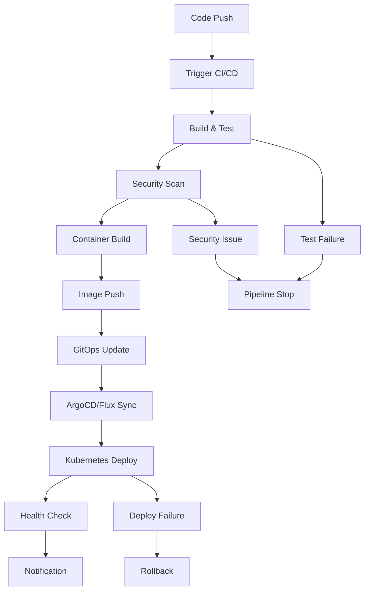

# Design Document

## Overview

This design provides a comprehensive DevOps pipeline solution for Kubernetes workloads that emphasizes production readiness, security, and operational resilience. The solution includes multi-platform CI/CD implementations, detailed repository strategy analysis, and battle-tested Kubernetes configurations that support cluster operations and multi-tenancy.

The design follows GitOps principles with clear separation of concerns between application code, infrastructure configuration, and deployment orchestration. It provides practical examples that teams can adapt to their specific needs while maintaining security and reliability standards.

## Architecture

### High-Level Pipeline Flow



### Repository Strategy Architecture

#### Monorepo Structure
```
monorepo/
├── applications/
│   ├── web-app/
│   │   ├── src/
│   │   ├── Dockerfile
│   │   └── k8s/
│   └── api-service/
│       ├── src/
│       ├── Dockerfile
│       └── k8s/
├── shared/
│   ├── libraries/
│   └── configs/
├── infrastructure/
│   ├── terraform/
│   └── helm-charts/
└── pipelines/
    ├── .github/
    └── .gitlab-ci/
```

#### Multi-repo Structure
```
org/web-app/
├── src/
├── Dockerfile
├── k8s/
└── .github/workflows/

org/api-service/
├── src/
├── Dockerfile
├── k8s/
└── .github/workflows/

org/infrastructure/
├── terraform/
├── helm-charts/
└── .github/workflows/

org/shared-libraries/
├── lib1/
├── lib2/
└── .github/workflows/
```

## Components and Interfaces

### CI/CD Platform Components

#### 1. GitHub Actions Implementation
- **Workflow Triggers**: Push, PR, manual dispatch
- **Build Matrix**: Multi-architecture support (amd64, arm64)
- **Caching Strategy**: Docker layer caching, dependency caching
- **Security Integration**: OIDC authentication, secret management
- **Deployment Gates**: Environment protection rules

#### 2. GitLab CI Implementation  
- **Pipeline Stages**: Build, test, security, deploy
- **Dynamic Environments**: Review apps, staging, production
- **Registry Integration**: Built-in container registry
- **Security Features**: SAST, DAST, container scanning
- **Deployment Strategies**: Blue-green, canary deployments


### Security Components

#### Container Security
- **Base Image Scanning**: Trivy, Snyk, or Clair integration
- **Runtime Security**: Falco for runtime threat detection
- **Image Signing**: Cosign for supply chain security
- **Policy Enforcement**: OPA Gatekeeper for admission control

#### Secret Management
- **External Secrets**: Integration with HashiCorp Vault, AWS Secrets Manager
- **Kubernetes Secrets**: Encrypted at rest, RBAC protected
- **CI/CD Secrets**: Platform-native secret stores
- **Rotation Strategy**: Automated secret rotation workflows

### Kubernetes Resilience Components

#### Resource Management
- **Resource Quotas**: Namespace-level resource limits
- **Limit Ranges**: Default and maximum resource constraints
- **Priority Classes**: Workload prioritization during resource contention
- **Quality of Service**: Guaranteed, Burstable, BestEffort classifications

#### High Availability
- **Pod Disruption Budgets**: Minimum available replicas during disruptions
- **Anti-Affinity Rules**: Pod distribution across nodes and zones
- **Readiness/Liveness Probes**: Health check configurations
- **Graceful Shutdown**: SIGTERM handling and termination grace periods

## Data Models

### Pipeline Configuration Model
```yaml
pipeline:
  name: string
  triggers:
    - push: [branches]
    - pull_request: [branches]
    - schedule: cron
  stages:
    - name: string
      jobs: [Job]
  environments:
    - name: string
      protection_rules: [Rule]

job:
  name: string
  runs_on: string
  steps: [Step]
  matrix: object
  timeout: duration

step:
  name: string
  uses: string
  with: object
  env: object
```

### Kubernetes Workload Model
```yaml
workload:
  apiVersion: apps/v1
  kind: Deployment
  metadata:
    name: string
    labels: object
    annotations: object
  spec:
    replicas: integer
    strategy: DeploymentStrategy
    template:
      spec:
        containers: [Container]
        affinity: Affinity
        tolerations: [Toleration]
        priorityClassName: string

container:
  name: string
  image: string
  resources:
    requests: ResourceList
    limits: ResourceList
  probes:
    readiness: Probe
    liveness: Probe
    startup: Probe
  lifecycle:
    preStop: Handler
```

### Repository Strategy Decision Matrix
```yaml
decision_factors:
  team_size:
    small: "< 10 developers"
    medium: "10-50 developers"  
    large: "> 50 developers"
  
  project_complexity:
    simple: "Single application"
    moderate: "2-5 related services"
    complex: "> 5 services with dependencies"
  
  deployment_frequency:
    low: "Weekly or less"
    medium: "Daily"
    high: "Multiple times per day"
  
  technology_diversity:
    homogeneous: "Single language/framework"
    mixed: "2-3 languages/frameworks"
    diverse: "> 3 languages/frameworks"
```

## Error Handling

### Pipeline Failure Scenarios

#### Build Failures
- **Compilation Errors**: Clear error reporting with line numbers
- **Test Failures**: Detailed test reports with failure analysis
- **Dependency Issues**: Dependency resolution and security alerts
- **Resource Limits**: Build timeout and resource exhaustion handling

#### Security Failures
- **Vulnerability Detection**: CVE reporting with severity levels
- **Policy Violations**: OPA policy violation details
- **Secret Exposure**: Automated secret detection and blocking
- **Compliance Issues**: Regulatory compliance validation

#### Deployment Failures
- **Resource Constraints**: Insufficient cluster resources
- **Configuration Errors**: Invalid Kubernetes manifests
- **Health Check Failures**: Application startup and readiness issues
- **Network Issues**: Service mesh and ingress configuration problems

### Recovery Strategies

#### Automated Recovery
- **Retry Logic**: Exponential backoff for transient failures
- **Circuit Breakers**: Prevent cascading failures
- **Rollback Triggers**: Automatic rollback on health check failures
- **Canary Analysis**: Automated canary deployment analysis

#### Manual Recovery
- **Approval Gates**: Manual intervention points
- **Emergency Procedures**: Break-glass deployment processes
- **Incident Response**: Runbook integration and alerting
- **Post-Mortem**: Failure analysis and improvement tracking

## Testing Strategy

### Pipeline Testing

#### Unit Testing
- **Pipeline Validation**: Syntax and logic validation
- **Mock Environments**: Isolated testing environments
- **Component Testing**: Individual pipeline stage testing
- **Integration Testing**: End-to-end pipeline validation

#### Security Testing
- **SAST**: Static application security testing
- **DAST**: Dynamic application security testing
- **Container Scanning**: Image vulnerability assessment
- **Infrastructure Testing**: Terraform and Kubernetes security validation

### Kubernetes Testing

#### Workload Testing
- **Resource Validation**: Resource request and limit testing
- **Resilience Testing**: Chaos engineering with tools like Chaos Monkey
- **Performance Testing**: Load testing with realistic traffic patterns
- **Upgrade Testing**: Kubernetes version upgrade validation

#### Multi-tenancy Testing
- **Isolation Testing**: Namespace and network policy validation
- **Resource Contention**: Multi-tenant resource sharing scenarios
- **Security Boundaries**: RBAC and security context testing
- **Compliance Testing**: Regulatory and organizational policy validation

## Repository Strategy Analysis

### Monorepo Advantages
- **Unified Versioning**: Single source of truth for all components
- **Simplified Dependencies**: Easier cross-service dependency management
- **Atomic Changes**: Cross-service changes in single commits
- **Shared Tooling**: Consistent build and deployment tools
- **Code Reuse**: Easier sharing of common libraries and utilities

### Monorepo Disadvantages
- **Build Complexity**: Longer build times as codebase grows
- **Access Control**: Difficult to restrict access to specific components
- **Scaling Issues**: Git performance degrades with repository size
- **Team Autonomy**: Reduced team independence and ownership
- **Technology Constraints**: Harder to use different tech stacks

### Multi-repo Advantages
- **Team Autonomy**: Independent development and deployment cycles
- **Technology Flexibility**: Different tech stacks per service
- **Access Control**: Granular repository-level permissions
- **Build Performance**: Faster, focused builds per repository
- **Fault Isolation**: Issues in one repo don't affect others

### Multi-repo Disadvantages
- **Dependency Management**: Complex cross-repository dependencies
- **Versioning Complexity**: Coordinating versions across repositories
- **Tooling Overhead**: Duplicated CI/CD configurations
- **Code Duplication**: Harder to share common code and libraries
- **Integration Testing**: Complex cross-service testing scenarios

### Decision Framework

#### Choose Monorepo When:
- Team size < 50 developers
- Tightly coupled services with frequent cross-service changes
- Homogeneous technology stack
- Strong emphasis on code sharing and consistency
- Centralized DevOps team managing all deployments

#### Choose Multi-repo When:
- Team size > 50 developers with multiple autonomous teams
- Loosely coupled services with independent release cycles
- Diverse technology stacks across services
- Strong team ownership and autonomy requirements
- Distributed DevOps responsibilities

#### Hybrid Approach:
- **Service Groups**: Related services in shared repositories
- **Platform Components**: Shared infrastructure in separate repositories
- **Application Boundaries**: Business domain-driven repository boundaries
- **Gradual Migration**: Start with monorepo, split as teams grow