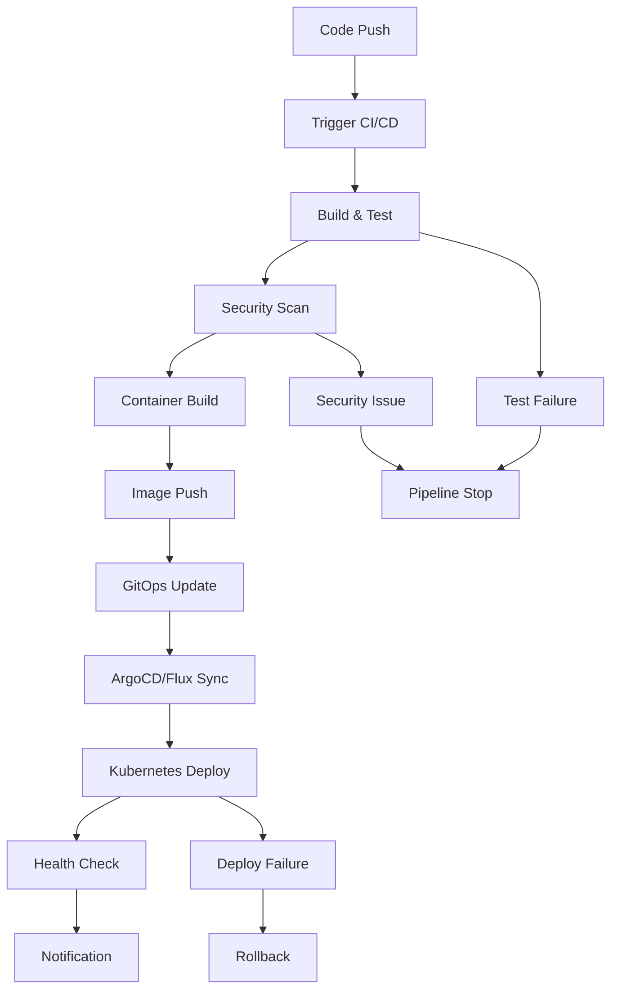

# Design Document

## Overview

This design provides a comprehensive DevOps pipeline solution for Kubernetes workloads using a monorepo architecture that emphasizes production readiness, security, and operational resilience. The solution includes multi-platform CI/CD implementations and battle-tested Kubernetes configurations that support cluster operations and multi-tenancy.

The design follows GitOps principles with clear separation of concerns between application code, infrastructure configuration, and deployment orchestration. The monorepo structure enables unified versioning, shared tooling, and atomic cross-service changes while maintaining security and reliability standards.

## Architecture

### High-Level Pipeline Flow



### Monorepo Architecture

#### Repository Structure
```
monorepo/
├── applications/
│   ├── web-app/
│   │   ├── src/
│   │   ├── Dockerfile
│   │   ├── package.json
│   │   └── k8s/
│   └── api-service/
│       ├── src/
│       ├── Dockerfile
│       ├── package.json
│       └── k8s/
├── shared/
│   ├── libraries/
│   │   ├── logger/
│   │   └── config/
│   ├── configs/
│   │   ├── eslint/
│   │   └── jest/
│   └── types/
├── infrastructure/
│   ├── kubernetes/
│   │   ├── base/
│   │   └── overlays/
│   ├── terraform/
│   └── helm-charts/
├── pipelines/
│   ├── .github/
│   │   └── workflows/
│   └── .gitlab-ci/
├── scripts/
│   ├── build/
│   ├── deploy/
│   └── test/
└── docs/
    ├── architecture/
    └── deployment/
```

#### Build Strategy
- **Selective Builds**: Only build changed applications and their dependencies
- **Shared Dependencies**: Common libraries managed centrally
- **Build Caching**: Aggressive caching for unchanged components
- **Parallel Execution**: Independent services build in parallel

## Components and Interfaces

### CI/CD Platform Components

#### 1. GitHub Actions Implementation
- **Workflow Triggers**: Push, PR, manual dispatch with path-based filtering
- **Selective Builds**: Changed service detection using git diff
- **Build Matrix**: Multi-architecture support (amd64, arm64)
- **Caching Strategy**: Docker layer caching, dependency caching, build artifacts
- **Security Integration**: OIDC authentication, secret management
- **Deployment Gates**: Environment protection rules
- **Monorepo Features**: Reusable workflows, shared actions, dependency management

#### 2. GitLab CI Implementation  
- **Pipeline Stages**: Build, test, security, deploy with selective execution
- **Dynamic Environments**: Review apps, staging, production
- **Registry Integration**: Built-in container registry
- **Security Features**: SAST, DAST, container scanning
- **Deployment Strategies**: Blue-green, canary deployments
- **Monorepo Features**: Rules-based job execution, shared templates, artifact management


### Security Components

#### Container Security
- **Base Image Scanning**: Trivy, Snyk, or Clair integration
- **Runtime Security**: Falco for runtime threat detection
- **Image Signing**: Cosign for supply chain security
- **Policy Enforcement**: OPA Gatekeeper for admission control

#### Secret Management
- **External Secrets**: Integration with HashiCorp Vault, AWS Secrets Manager
- **Kubernetes Secrets**: Encrypted at rest, RBAC protected
- **CI/CD Secrets**: Platform-native secret stores
- **Rotation Strategy**: Automated secret rotation workflows

### Kubernetes Resilience Components

#### Resource Management
- **Resource Quotas**: Namespace-level resource limits
- **Limit Ranges**: Default and maximum resource constraints
- **Priority Classes**: Workload prioritization during resource contention
- **Quality of Service**: Guaranteed, Burstable, BestEffort classifications

#### High Availability
- **Pod Disruption Budgets**: Minimum available replicas during disruptions
- **Anti-Affinity Rules**: Pod distribution across nodes and zones
- **Readiness/Liveness Probes**: Health check configurations
- **Graceful Shutdown**: SIGTERM handling and termination grace periods

## Data Models

### Pipeline Configuration Model
```yaml
pipeline:
  name: string
  triggers:
    - push: [branches]
    - pull_request: [branches]
    - schedule: cron
  stages:
    - name: string
      jobs: [Job]
  environments:
    - name: string
      protection_rules: [Rule]

job:
  name: string
  runs_on: string
  steps: [Step]
  matrix: object
  timeout: duration

step:
  name: string
  uses: string
  with: object
  env: object
```

### Kubernetes Workload Model
```yaml
workload:
  apiVersion: apps/v1
  kind: Deployment
  metadata:
    name: string
    labels: object
    annotations: object
  spec:
    replicas: integer
    strategy: DeploymentStrategy
    template:
      spec:
        containers: [Container]
        affinity: Affinity
        tolerations: [Toleration]
        priorityClassName: string

container:
  name: string
  image: string
  resources:
    requests: ResourceList
    limits: ResourceList
  probes:
    readiness: Probe
    liveness: Probe
    startup: Probe
  lifecycle:
    preStop: Handler
```

### Monorepo Configuration Model
```yaml
monorepo_config:
  structure:
    applications: "Service applications with independent deployments"
    shared: "Common libraries and configurations"
    infrastructure: "Kubernetes manifests and infrastructure code"
    pipelines: "CI/CD configurations and workflows"
  
  build_strategy:
    selective_builds: true
    dependency_tracking: true
    parallel_execution: true
    caching_enabled: true
  
  deployment_model:
    independent_services: true
    shared_infrastructure: true
    environment_promotion: true
    rollback_capability: true
```

## Error Handling

### Pipeline Failure Scenarios

#### Build Failures
- **Compilation Errors**: Clear error reporting with line numbers
- **Test Failures**: Detailed test reports with failure analysis
- **Dependency Issues**: Dependency resolution and security alerts
- **Resource Limits**: Build timeout and resource exhaustion handling

#### Security Failures
- **Vulnerability Detection**: CVE reporting with severity levels
- **Policy Violations**: OPA policy violation details
- **Secret Exposure**: Automated secret detection and blocking
- **Compliance Issues**: Regulatory compliance validation

#### Deployment Failures
- **Resource Constraints**: Insufficient cluster resources
- **Configuration Errors**: Invalid Kubernetes manifests
- **Health Check Failures**: Application startup and readiness issues
- **Network Issues**: Service mesh and ingress configuration problems

### Recovery Strategies

#### Automated Recovery
- **Retry Logic**: Exponential backoff for transient failures
- **Circuit Breakers**: Prevent cascading failures
- **Rollback Triggers**: Automatic rollback on health check failures
- **Canary Analysis**: Automated canary deployment analysis

#### Manual Recovery
- **Approval Gates**: Manual intervention points
- **Emergency Procedures**: Break-glass deployment processes
- **Incident Response**: Runbook integration and alerting
- **Post-Mortem**: Failure analysis and improvement tracking

## Testing Strategy

### Pipeline Testing

#### Unit Testing
- **Pipeline Validation**: Syntax and logic validation
- **Mock Environments**: Isolated testing environments
- **Component Testing**: Individual pipeline stage testing
- **Integration Testing**: End-to-end pipeline validation

#### Security Testing
- **SAST**: Static application security testing
- **DAST**: Dynamic application security testing
- **Container Scanning**: Image vulnerability assessment
- **Infrastructure Testing**: Terraform and Kubernetes security validation

### Kubernetes Testing

#### Workload Testing
- **Resource Validation**: Resource request and limit testing
- **Resilience Testing**: Chaos engineering with tools like Chaos Monkey
- **Performance Testing**: Load testing with realistic traffic patterns
- **Upgrade Testing**: Kubernetes version upgrade validation

#### Multi-tenancy Testing
- **Isolation Testing**: Namespace and network policy validation
- **Resource Contention**: Multi-tenant resource sharing scenarios
- **Security Boundaries**: RBAC and security context testing
- **Compliance Testing**: Regulatory and organizational policy validation

## Monorepo Implementation Strategy

### Core Benefits
- **Unified Versioning**: Single source of truth for all components with atomic releases
- **Simplified Dependencies**: Easier cross-service dependency management and updates
- **Atomic Changes**: Cross-service changes in single commits with coordinated deployments
- **Shared Tooling**: Consistent build, test, and deployment tools across all services
- **Code Reuse**: Centralized shared libraries and utilities with version consistency

### Implementation Approach

#### Selective Build System
- **Change Detection**: Git-based detection of modified services and dependencies
- **Build Optimization**: Only build affected services and their dependents
- **Caching Strategy**: Aggressive caching of unchanged components and dependencies
- **Parallel Execution**: Independent services build concurrently when possible

#### Dependency Management
- **Shared Libraries**: Centralized common code with semantic versioning
- **Configuration Management**: Shared configurations with service-specific overrides
- **Tool Standardization**: Consistent linting, testing, and build tools
- **Version Synchronization**: Coordinated updates across all services

#### Team Collaboration
- **Code Ownership**: Clear ownership boundaries using CODEOWNERS files
- **Branch Strategy**: Feature branches with service-specific prefixes
- **Review Process**: Automated routing to appropriate teams based on changed files
- **Integration Testing**: Comprehensive cross-service testing in CI/CD pipeline

### Scaling Considerations
- **Build Performance**: Implement incremental builds and distributed caching
- **Repository Size**: Use Git LFS for large assets and regular cleanup
- **Access Control**: Branch protection rules and path-based permissions
- **Team Autonomy**: Service-specific deployment pipelines within unified CI/CD